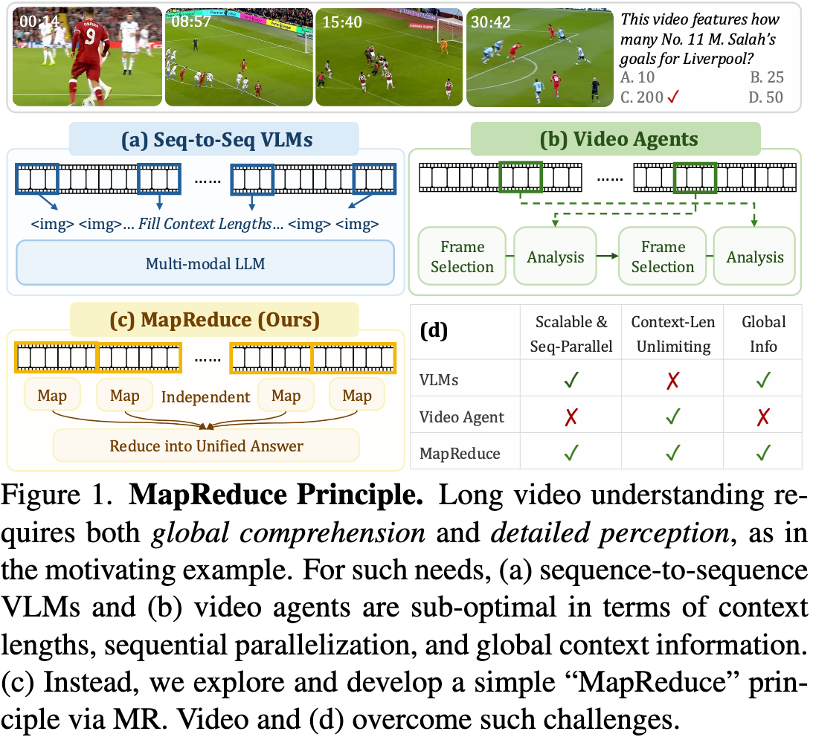
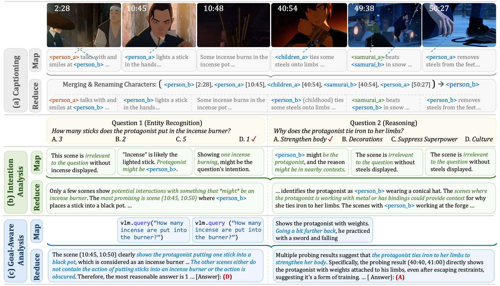

# MR. Video: "MapReduce" is the Principle for Long Video Understanding

[Ziqi Pang](https://ziqipang.github.io/), [Yuxiong Wang](https://yxw.cs.illinois.edu/)

[[`arXiv`](https://arxiv.org/abs/2504.16082)] [[`HuggingFace`](https://huggingface.co/datasets/ziqipang/MR-Video)]

[](https://arxiv.org/abs/2504.16082)
[](https://huggingface.co/ziqipang/MR-Video)
[](https://opensource.org/licenses/MIT)


## Introduction

What is the ultimate principle for long video understanding? Let's think about the most perfect criteria: **digesting global contexts while perceiving local details simultaneously**. For example, a question of "counting how many goals are there in the sports video" requires both **global context** (e.g., the overall scene) and **local details** (e.g., the specific action of scoring).

Motivated by this ultimate criteria, we validate the **MapReduce** principle for long video understanding (1) Map: Sequence-parallel and dense understanding of short segments, (2) Reduce: Global reasoning over the whole video. 

Compared with VLMs, MapReduce overcomes the context length limitations; compared with video agents, MapReduce enables better scalability due to the sequence-parallel design of Map steps. (as below)



Due to our limited GPU resourced in academia, we only validate this principle via an LLM agents. **We fully embrace if you have any plan or question of integrating this principle into your VLMs**. We will be more than happy to discuss with you.

## Get Started

We preparing the code and dataset step by step. However, we believe that the **data**, especially the captions and intermediate reasoning steps of our video agent, MR. Video, will be the most valuable part.

Therefore, we have already released the captions on huggingface. Our captions featured mindful consistency of the characters (as below), which might be useful for your supervised fine-tuning (SFT). Please stay tuned for the other parts.

[[LVBench Captions](https://huggingface.co/datasets/ziqipang/MR-Video/resolve/main/lvbench_captions.zip)] [[EgoSchema (Val) Captions](https://huggingface.co/datasets/ziqipang/MR-Video/resolve/main/egoschema_captions.zip)][[VideoMME (Long w/o sub) Captions](https://huggingface.co/datasets/ziqipang/MR-Video/resolve/main/videomme_captions.zip)][[Long Video Bench (Val, Long) Captions](https://huggingface.co/datasets/ziqipang/MR-Video/resolve/main/longvideobench_captions.zip)]



## Citation

If you find this work useful in your research, please consider citing:

```bibtex
@article{pang2025mrvideo,
  title={MR. Video: "MapReduce" is the Principle for Long Video Understanding},
  author={Pang, Ziqi and Wang, Yu-Xiong},
  journal={arXiv preprint arXiv:2504.16082},
  year={2025}
}